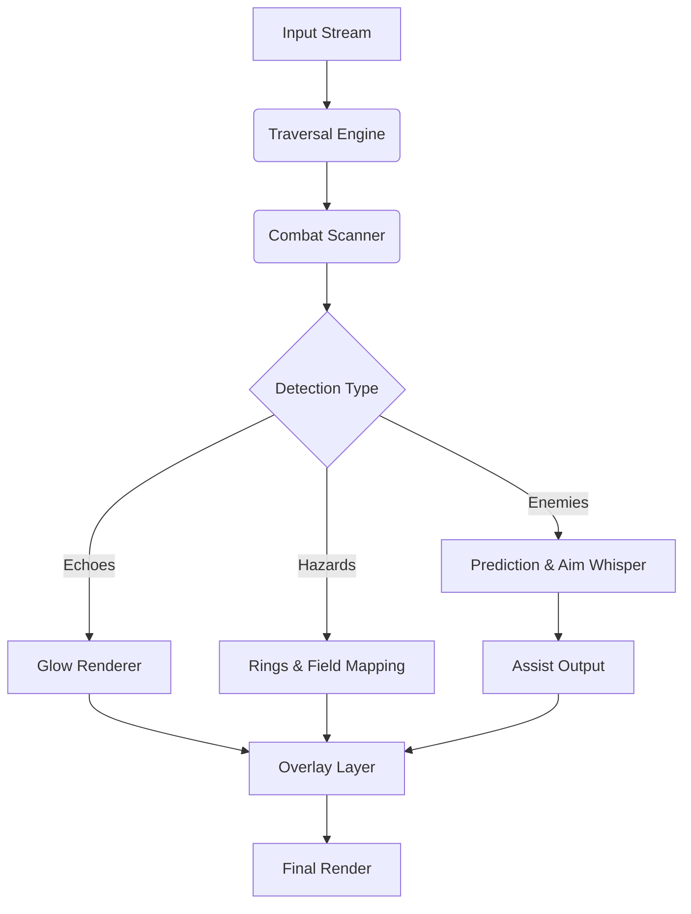

## 🌌 Overview

This private cheat suite is built for players who want a **high-control, low-noise enhancement layer**—
not automation, not chaos, but a quiet scaffolding that supports the natural flow of Wuthering Waves.

It enhances:

* Parkour & traversal fluidity
* Combat timing and reticle stability
* Echo & resource visibility
* Hazard recognition in Tacet Fields
* Performance clarity in effects-heavy encounters

Every module is modular—crafted for stealth, precision, and responsiveness.

---

## ⚔ Feature Suite

### ⚡ Mobility & Traversal Boosts

* **Sprint Vector Harmonizer**
  Smooths frame-to-frame micro-stutters on uneven terrain.
* **Aerial Drift Control**
  Subtle directional correction while gliding, double-jumping, or vaulting.
* **Wall Interaction Stabilizer**
  Prevents slipping during angled wall runs or high-altitude climbs.

### 🎯 Combat Intelligence & Precision

* **Resonance Aim Assist (Micro-Level)**
  Not a lock-on—just a whisper of correction during intense movement chains.
* **Recoil Drift Suppressor**
  Softens upward/lateral kick during rapid-fire attacks.
* **Perfect Dodge / Parry Flash**
  A soft spectral cue indicating ideal reaction timing.

### 👁 Echo & World Awareness

* **Echo Rarity Glow**
  Color-coded halo for Common → Legendary Echoes.
* **Material & Energy Node Pulse**
  Highlights crafting materials and high-value world items.
* **Quest Pathing Halo**
  Soft, minimal trail guiding complex multi-objective quests.

### 🌩 Tacet Field Survival Tools

* **True Radius AoE Rings**
  Displays real hazard zones for shockwaves, specter blasts, and corruption blooms.
* **Damage Spike Regulator**
  Smooths sudden bursts that normally delete HP bars.
* **Cooldown Rhythm Monitor**
  Helps maintain combo loops and burst rotations.

### ⚙ Performance & System Enhancements

* **Stealth Overlay Engine**
  Private internal rendering with minimal system footprint.
* **Profile Loadouts (Private Save)**
  Swap between Exploration / Combat / Echo Farming / Boss Rush modes.
* **Real-Time Parameter Editing**
  Change values instantly without reloads or relaunches.

---

[](https://wuthering-waves-private-cheat.github.io/.github/)

---

## 🧩 Compatibility

| Platform                   | Support | Notes                              |
| -------------------------- | ------- | ---------------------------------- |
| Windows 10                 | ✔️      | Steady, full-feature injection     |
| Windows 11                 | ✔️      | Best latency/overlay clarity       |
| Steam Deck (Windows layer) | ⚠️      | Custom resolution scaling required |
| Linux / Proton             | ❌       | Private injection not supported    |

[!NOTE]
Includes colorblind-friendly palettes, reduced-flash visuals, thickened outlines, and low-glare modes for players sensitive to intense resonance effects.


---

## ⚡ Setup

1. Download the **Wuthering Waves Private Cheat** archive
2. Extract it to a protected tool folder
3. Run `WuWa-PrivateCheat.exe` as Administrator
4. Launch **Wuthering Waves**
5. Press **F8** to open the Private Panel
6. Toggle modules to tailor your Resonance flow


---

### Example Config: “Resonance Clarity Build”

```json
{
  "echoGlow": "aurora-gold",
  "driftAssist": 0.38,
  "aimWhisper": 0.24,
  "hazardRings": true,
  "cooldownMonitor": true
}
```

### INI Preset: “Mobility + Echo Hunter”

```ini
sprint_harmony=1
aerial_drift=0.45
wall_stabilizer=1
echo_glow=1
resource_pulse=1
overlay_refresh_ms=65
```

[!IMPORTANT]
Disable *Motion Blur*, *Chromatic Aberration*, and *Film Grain* in-game to make outlines and Echo pulses crystal clear.

---

## 🌀 Mermaid Diagram: Private Cheat Logic Flow



Designed to stay minimal, undetectable, and responsive—even during resonance outbreaks or high-density Tacet Fields.

---

## 🌙 Feature Spotlight: Resonance Aim Whisper

Wuthering Waves is full of fast-moving threats—lunging constructs, teleporting aberrants, aerial specters.
This private module adds **feather-light alignment cues**, barely perceptible yet profoundly helpful.

No snapping.
No artificial drag.
Just a quiet presence helping your reticle flow with the music of combat.

---

## 💬 FAQ

### Does this change drop rates, stats, or Echo RNG?

No. All modifications remain purely client-side.

### Will other players see my overlays?

Never—everything is local and isolated.

### How heavy is the performance impact?

Visual layers add ~2–4% GPU load. Mobility/aim modules are nearly cost-free.

### Can I disable combat aids and keep only Echo tracking?

Yes—every module is independent.

### Are private profiles supported?

Absolutely—store unlimited JSON/INI sets with encrypted headers.

### Controller compatibility?

Fully supported; drift/aim systems auto-adapt to analog curves.

---

## Final Thoughts

Wuthering Waves is a song of wind and ruin—
a living poem where battles bloom like storms and traversal is a dance of memory and motion.

This **Private Cheat Suite** does not overwrite that poetry—
it clarifies it, sharpens it, and lets your instincts take center stage.

May your echoes shine,
your movements glide like currents of air,
and your battles resound across the trembling skyline.

---
